# Installing Python on Windows - Simple guide for beginners

Total time: 5-10 minutes

## Overview

- [Step 1: Download the installer](#step-1-download-the-installer)
- [Step 2: Run the installer](#step-2-run-the-installer)
- [Step 3: Select correct options](#step-3-select-correct-options)
- [Step 4: Start installation](#step-4-start-installation)
- [Step 5: Wait for installation (2-5 minutes)](#step-5-wait-for-installation-2-5-minutes)
- [Step 6: Open Windows Terminal](#step-6-open-windows-terminal)
- [Step 7: Verify the installation](#step-7-verify-the-installation)
- [Step 8: Disable path length limit](#step-8-disable-path-length-limit)
  - [_Python installation complete!_](#python-installation-complete)
- [Step 9: Play around with Python](#step-9-play-around-with-python)
  - [More to copy-paste and try out](#more-to-copy-paste-and-try-out)

## Step 0: Prepare Your Workspace (Optional)

Place this guide on one side of your screen by pressing: Windows key + Right Arrow.

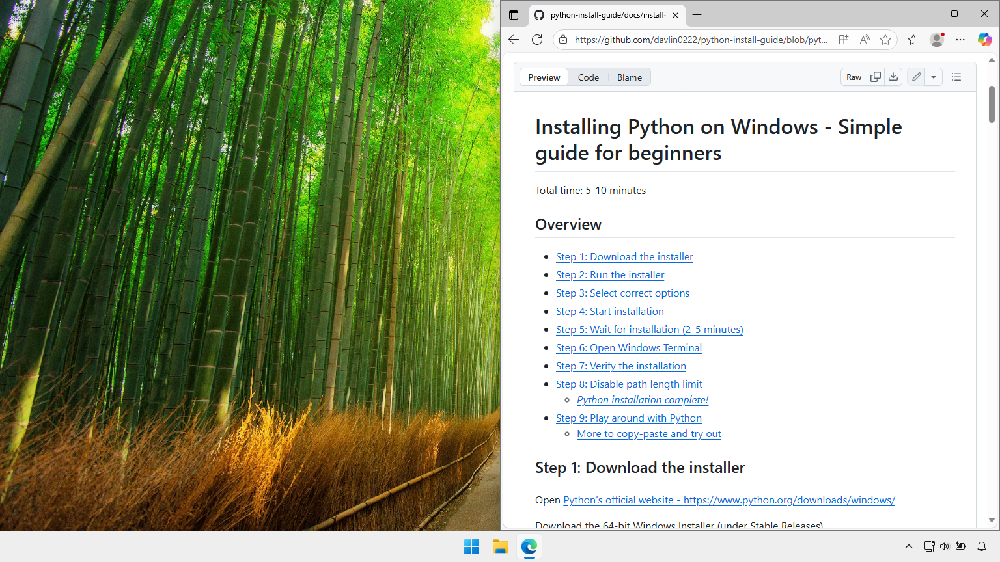

## Step 1: Download the installer

Open <a href="https://www.python.org/downloads/windows/" target="_blank">Python's official website - https://www.python.org/downloads/windows/</a>

Download the 64-bit Windows Installer (under Stable Releases).

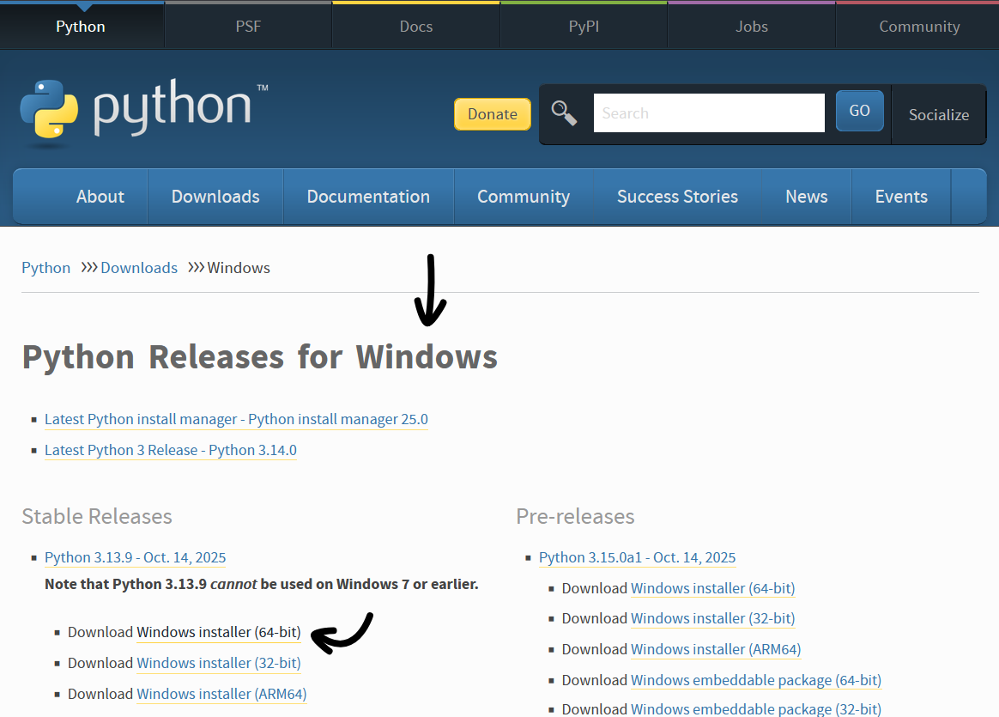

## Step 2: Run the installer

Open Windows explorer (shortcut: Windows key + E).

Open Downloads.

Double click on the installer to run it.

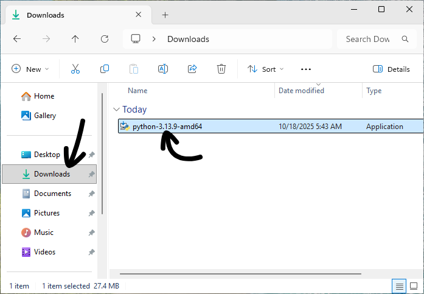

## Step 3: Select correct options

Check both checkboxes at the bottom.

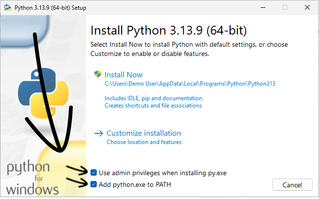

## Step 4: Start installation

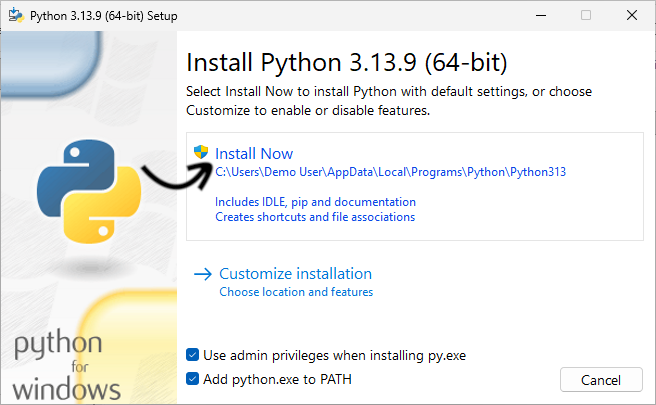

## Step 5: Wait for installation (2-5 minutes)

**Don't click on any buttons after the installer finishes.**

(Extra info: We'll continue from this screen in step number 8. It's not a problem if you clicked something. It's just good to check the installation worked before moving on.)

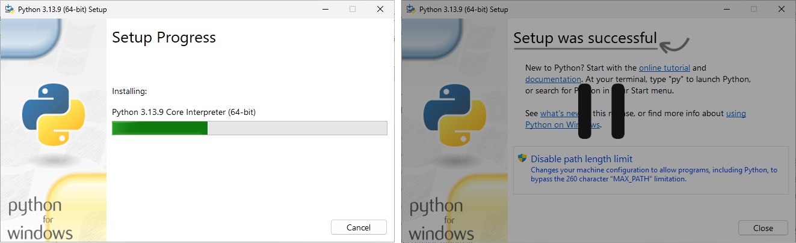

## Step 6: Open Windows Terminal

Open Windows search.

Find and open `Terminal`.

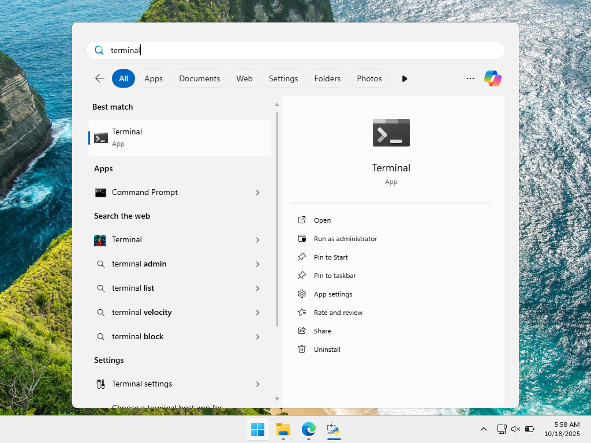

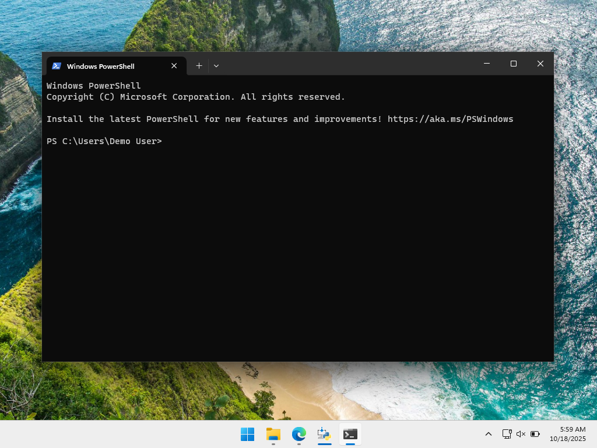

## Step 7: Verify the installation

Type `python --version` and hit Enter.

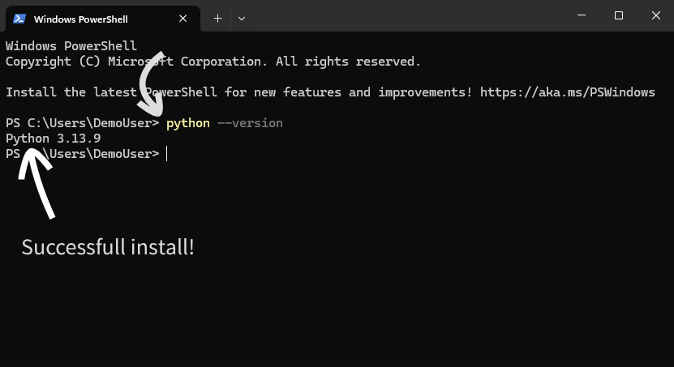

The output should be "Python" followed by the version. This indicates that the installation was fully successful.

## Step 8: Disable path length limit

> Optional, but recommended

Switch back to the Python Installer and click "Disable path length limit".

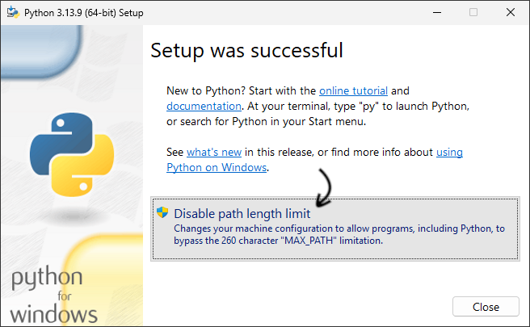

### _Python installation complete!_

## Step 9: Try out some Python 

Close the installer.

Try out writing some Python code in Python's Interactive Shell.

Type `python` and hit Enter.

To exit, type `exit()` and hit Enter (and close the terminal).

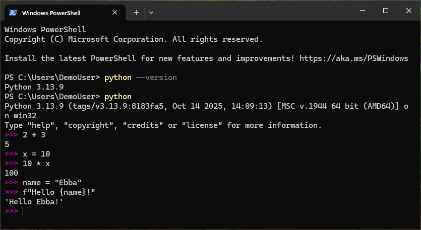

### Keyboard shortcuts

- **Ctrl + D** – Exit the Python Interactive Shell
- **Ctrl + C** – Interrupt the current running command
- **Ctrl + L** – Clear the screen
- **Up / Down Arrow** – Navigate through command history
- **Tab** – Autocomplete variable, function, or module names

### More to try using copy-paste

Level 1

```py
>>> numbers = [1, 2, 3, 4, 5]
>>> squared_numbers = [n**2 for n in numbers]
>>> squared_numbers
[1, 4, 9, 16, 25]

>>> import random
>>> random.choice(["Python", "JavaScript", "Ruby"])
'Python'

>>> # Use the underscore _ to reuse the last output
>>> _
'Python'

>>> "Language: " + _
'Language: Python'

>>> import math  # Load Python's math module
>>> math.factorial(6)  # Calculate 6 factorial (6 * 5 * 4 * 3 * 2 * 1)
720
```

Level 2

```py
>>> # Filter for low numbers
>>> low_numbers = [n for n in squared_numbers if n < 10]
>>> low_numbers
[1, 4, 9]

>>> # Filter for even numbers
>>> even_numbers = [n for n in squared_numbers if n % 2 == 0]
>>> even_numbers
[4, 16]

>>> # Compute factorial of each even number using previous output (_)
>>> import math
>>> [math.factorial(n) for n in _]
[24, 20922789888000]
```

Level 3

```py
>>> # List of names
>>> names = ["Alice", "Bob", "Charlie", "Diana"]
>>> names
['Alice', 'Bob', 'Charlie', 'Diana']

>>> # Sort names alphabetically
>>> sorted(names)
['Alice', 'Bob', 'Charlie', 'Diana']

>>> # Filter names that contain the letter 'a' (case-insensitive)
>>> [name for name in names if 'a' in name.lower()]
['Alice', 'Charlie', 'Diana']

>>> # Create a dictionary mapping names to their lengths
>>> name_lengths = {name: len(name) for name in names}
>>> name_lengths
{'Alice': 5, 'Bob': 3, 'Charlie': 7, 'Diana': 5}

>>> # Convert all names to uppercase using map
>>> list(map(str.upper, names))
['ALICE', 'BOB', 'CHARLIE', 'DIANA']

>>> # Randomly pick a “winner” from the list
>>> import random
>>> random.choice(names)
'Charlie'

>>> # Reverse all names in the list
>>> [name[::-1] for name in names]
['ecilA', 'boB', 'eilrahC', 'anoiD']

>>> # Combine first letters of all names into one string
>>> ''.join([name[0] for name in names])
'ABCD'
```

Level 4

```py
>>> # Define a configuration object as a dictionary
>>> config = {
...     "username": "demo_user",
...     "theme": "dark",
...     "font_size": 14,
...     "plugins": ["spellcheck", "autosave", "syntax_highlight"]
... }
>>> config
{'username': 'demo_user', 'theme': 'dark', 'font_size': 14, 'plugins': ['spellcheck', 'autosave', 'syntax_highlight']}

>>> # Access a value
>>> config["theme"]
'dark'

>>> # Change a value
>>> config["font_size"] = 16
>>> config["font_size"]
16

>>> # Add a new key
>>> config["autosave_interval"] = 5  # in minutes
>>> config["autosave_interval"]
5

>>> # List all keys and values
>>> list(config.keys())
['username', 'theme', 'font_size', 'plugins', 'autosave_interval']
>>> list(config.values())
['demo_user', 'dark', 16, ['spellcheck', 'autosave', 'syntax_highlight'], 5]

>>> # Nested data access
>>> config["plugins"][1]  # second plugin
'autosave'

>>> # Loop through plugins
>>> for plugin in config["plugins"]:
...     print(plugin.upper())
...
SPELLCHECK
AUTOSAVE
SYNTAX_HIGHLIGHT
```
