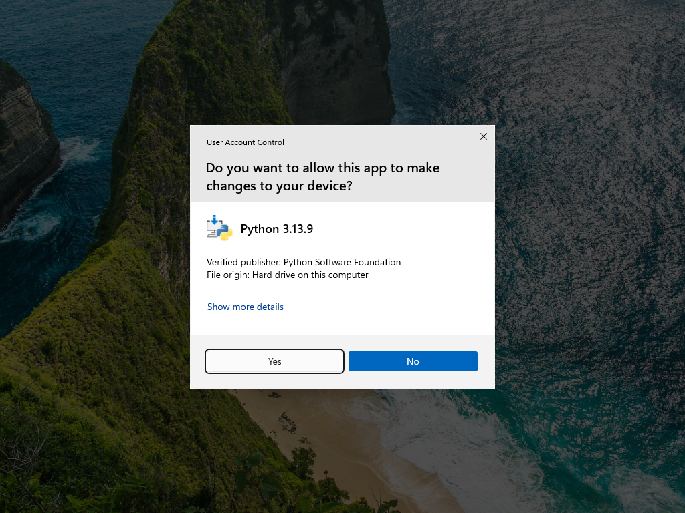
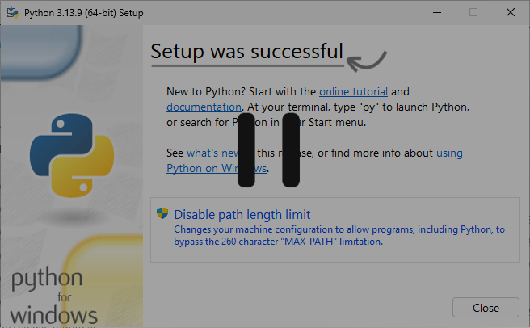

# Installing Python on Windows - Simple guide for beginners

Total time: 5-10 minutes

## Overview

- Step 1: Download the installer

- Step 2: Run the installer

- Step 3: Select correct options

- ...

## Step 1: Download the installer

Open [Python Releases for Windows - https://www.python.org/downloads/windows/](assets/install-python/https://www.python.org/downloads/windows/)

Download the 64-bit Windows Installer (under Stable Releases)


## Step 2: Run the installer

Open Windows explorer (shortcut: Windows key + E)

Open Downloads

Double click on the installer to run it


## Step 3: Select correct options

Check both checkboxes at the bottom.


## Step 4: Click "Install Now"


Click yes:



## Step 5: Wait for installation

Don't click on any more buttons once the installer finishes. (It's not a problem if you do. It's just good to check the installation worked before moving on). 




## Step 6: Open Windows Terminal

Open Windows search, find "Terminal" and open it.


## Step 7: Verify the installation

Type the below and hit enter
```sh
python --version
```


The output should be "Python" followed by the version if the installation was successful.

## Step 8: Optional but recommended

Reopen the open Python Installer and click


Click yes:


_Python installation complete!_